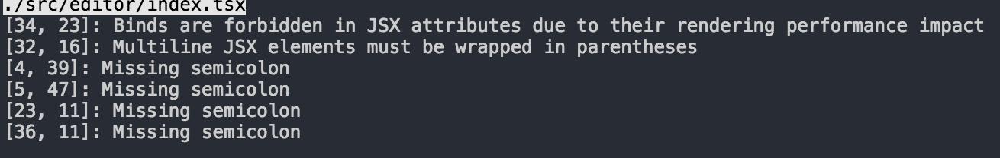

# 如何贡献代码

## 项目安装
项目运行需要npm v5版本, 如果npm版本过低,
需要升级npm
```
sudo npm install -g npm
```

安装依赖包
```bash
npm install
```

启动本地开发服务
```
npm start
```

## 远程调试
如果RCRE应用在一个angular项目中，并且是采用直接引入单个JS bundle的方式来运行。假如现在RCRE中存在bug，就可以使用远程调用模式来

方便开发。可以实现在RCRE中的源码一更新就自动重新编译，然后在angular写的项目重新刷新页面就可以了。

启动远程调试编译
```bash
npm run remoteDebug
```

待编译完成之后，将angular站点引入的js文件地址改成本地的地址。

比如之前的rcre地址是在cdn上的
```html
<script src="http://miskit.cdn.bcebos.com/miskit/rcre_0.10.51.js"></script>
```

现在改成本地的
```html
<script src="http://localhost:3000/static/js/bundle.js"></script>
```

然后就可以了

## 项目发布
RCRE 项目有3种发布模式，

1. 编译生成可以发布到npm
2. 编译生成可以直接使用的单文件
3. 编译文档站点

### 编译生成可以发布到npm
发布到npm是不需要将npm安装的依赖包也都编译到产出文件的，所以相对会比较小。

入口文件是src/render/index.tsx

**编译命令**
```bash
npm run plugin
```

发布到npm如果没有权限请联系 dongtiangche@outlook.com 来添加权限
**发布**
```bash
npm version patch
npm publish
```

### 编译生成可以直接使用的单文件
单文件模式是指生成的文件不需要任何构建工具，只需要同时引入React和ReactDOM就可以了。
RCRE所有的API都会挂载到window对象上，以RCRE_前缀的变量都是RCRE注入的API

入口文件是 src/render/index.tsx

**编译命令**
```bash
npm run build
```

**将编译产出发布到CDN**
在百度内部可以使用以下脚本：

```bash
npm version patch
node scripts/scripts/publish.js
```

### 编译文档网站
RCRE的主体和文档网站，和直接使用npm start的界面一致。

入口文件是 src/index.tsx

**编译命令**
```bash
npm run website
```

## 项目说明
此项目基于`TypeScript-React-Starter`构建, 集成Typescript, React, Webpack, tslint
扩展命令请看![README_usage.md](./README_usage.md)

## 开发说明
此项目采用typescript作为开发语言, 同时使用tslint来进行代码格式检查. 
执行`npm start`之后, 会启动一个本地开发服务, 之后的代码开发都是会自动进行编译

## 开发F&Q

这种问题是tslint检测到你的代码有格式问题. 请按照提示,到指定的文件和行号, 修改你的代码

注: 单元测试也同样放在`src`目录下, 以`.test.ts`或者`.test.tsx`为文件结尾

## 代码规范
本项目采用tslint才进行代码规范检测, 详细配置请看tslint配置项
