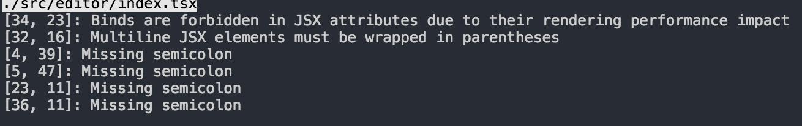

可视化构建系统
==============

## 如何安装

安装依赖包
```bash
npm install
```

启动本地开发服务
```
npm start
```

## 项目说明
此项目基于`TypeScript-React-Starter`构建, 集成Typescript, React, Webpack, tslint
扩展命令请看![README_usage.md](./README_usage.md)

## 开发说明
此项目采用typescript作为开发语言, 同时使用tslint来进行代码格式检查. 
执行`npm start`之后, 会启动一个本地开发服务, 之后的代码开发都是会自动进行编译

## 开发F&Q

这种问题是tslint检测到你的代码有格式问题. 请按照提示,到指定的文件和行号, 修改你的代码

## 目录结构说明
