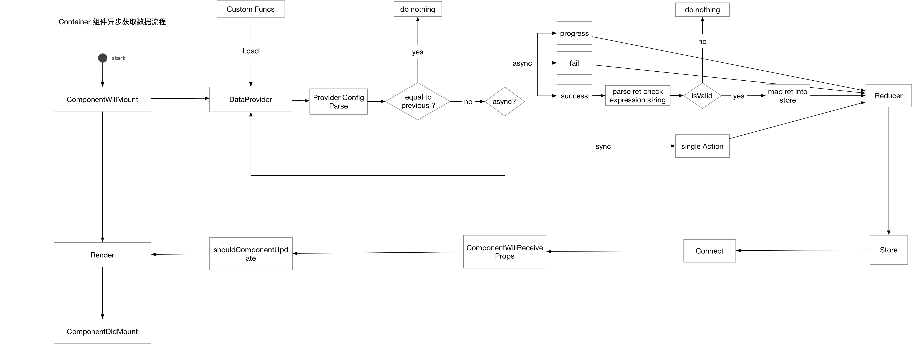

# DataProvider

DataProvider 是一个数据源控制器

它通过为Container组件提供一个单一, 简单的API调用. 来对各种各样的数据获取操作进行封装

它支持控制同步的数据和异步的数据操作. 获取到目标数据之后,

DataProvider会触发action来写入数据到redux store

## 逻辑视图


## Provider抽象类
DataProvider和各种Provider类类之间需要一个通用一致的协议来进行通讯.

这个通讯协议就称之为Provider抽象类

所有的Provider类都需要基于`BasicSyncProviderInterface`或者`BasicSyncProviderInterface`来实现响应的方法

+ BasicSyncProviderInterface 同步Provider抽象类
+ BasicAsyncProviderInterface 异步Provider抽象类 

在typescript, 根据抽象类来实现一个Provider 类可以参考一下例子

```typescript
import {BasicSyncProviderInterface, ProviderGlobalOptions} from '../render/core/DataProvider/Controller';
import {AjaxProviderSourceConfig} from '../render/core/DataProvider/providers/ajax';
import {ContainerProps} from '../render/core/Container/types';
import {compileValueExpress} from '../render/util/vm';
import * as _ from 'lodash';
class ExampleProvider implements BasicSyncProviderInterface {
    configCheck(provider: AjaxProviderSourceConfig) {
        console.log('在这里实现对provider配置的检查');
        return true;
    }
    
    retCheck(ret: Object, provider: AjaxProviderSourceConfig) {
        console.log('在这里实现对provider处理结果的检查');
        return true;
    }
    
    parse(provider: AjaxProviderSourceConfig, props: ContainerProps) {
        // 注意要用深拷贝, 方式provider对象通过引用被修改
        let copy = _.cloneDeep(provider);
                
        // 这里需要调用vm模块方法, 把expression String 转化成对应的值
        copy.config = compileValueExpress(copy.config, {
            $data: props.$data.toObject()
        });
        
        return copy;
    }
    
    run(provider: AjaxProviderSourceConfig, options: ProviderGlobalOptions = {}) {
        console.log('实现Provider需要的获取逻辑, 来进行最终数据的获取');
    }
}
```
 
## DataProvider 数据处理流程
Provider内部处理逻辑参考流程图. 这里需要说明一下Container的处理方式

DataProvider所需要的ProviderSourceConfig类型的对象是来自于用户写的页面JSON配置

例如: 如果一个Container组件添加一个ajaxDataProvider来让Container拥有调用ajax的能力.

首先, 我们需要先给这个新增的Provider起一个名字. 对于ajaxDataProvider的名字就叫做`ajax`

有了名字之后, 这样用户就可以在JSON配置中, 通过`ajax`这个名字. 来调起ajaxDataProvider.

例如:
```json
{
    "type": "container",
    "model": "demo",
    "dataProvider": [
        {
            "mode": "ajax",
            "config": {
                "url": "http://cp01-ebg-nativeads-50.cp01.baidu.com:8088/dataquality/datarule/ruledetaillist",
                "method": "GET"
            }
        }
    ]
}
```

这里例子里面, 就通过mode: 'ajax'来唤起AjaxDataProvider组件. 并把config配置传入到AjaxDataProvider进行处理
## 如何新增一个Provider组件

1. 写一个Class, 实现`BasicSyncProviderInterface`或者`BasicAsyncProviderInterface`
2. 在`src/render/core/DataProvider/loader.ts`内进行加载
3. 定义dataProvider数据格式以及mode名称
4. 编写单元测试

## 内置Provider组件

### AjaxDataProvider